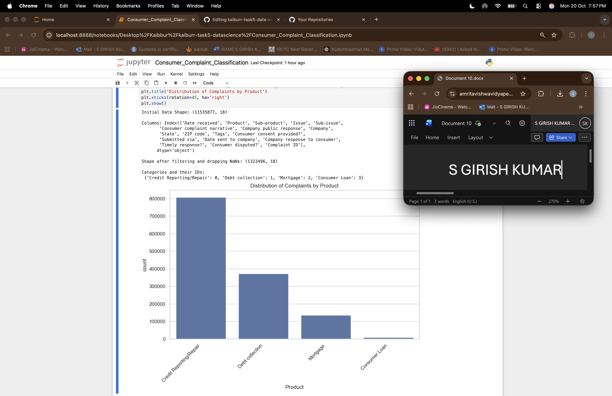
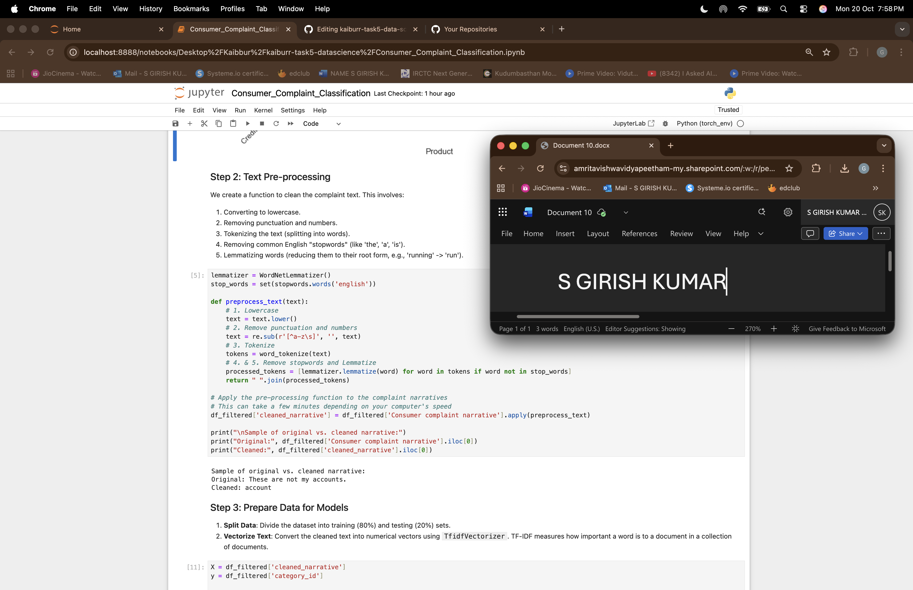
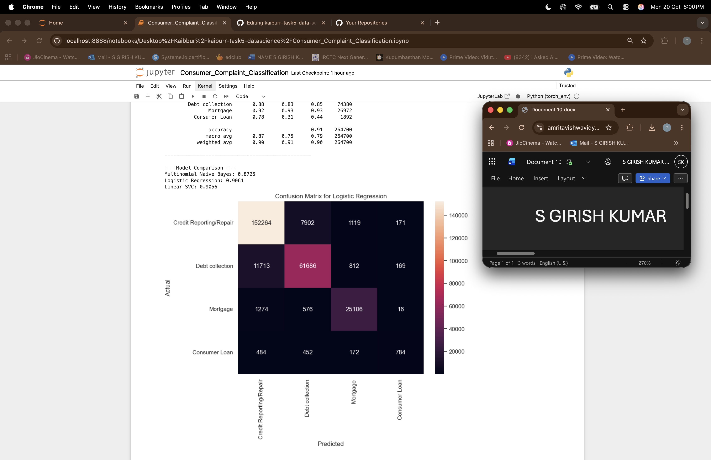
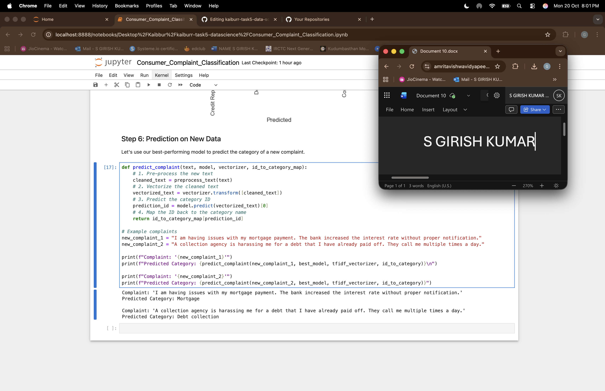

# Kaiburr Task 5: Consumer Complaint Classification

This project performs text classification on the Consumer Complaint Database to categorize consumer complaints into one of four product categories.

---

### Project Goal

The goal is to build and evaluate several machine learning models to accurately classify a given complaint narrative into one of the following categories:
- Credit Reporting/Repair
- Debt Collection
- Consumer Loan
- Mortgage

---

### Methodology

The project follows a standard data science workflow, as detailed in the Jupyter Notebook (`Consumer_Complaint_Classification.ipynb`):

1.  **Explanatory Data Analysis (EDA):** The dataset was loaded, filtered for the target categories, and cleaned of null values. The distribution of complaints was visualized.
2.  **Text Pre-processing:** Complaint narratives were cleaned by converting to lowercase, removing punctuation/numbers, tokenizing, removing stopwords, and lemmatizing.
3.  **Feature Extraction:** The cleaned text was converted into numerical vectors using TF-IDF.
4.  **Model Training & Comparison:** Three models (Multinomial Naive Bayes, Logistic Regression, Linear SVC) were trained on the data.
5.  **Model Evaluation:** Models were evaluated based on accuracy and a detailed classification report. The Linear SVC model performed the best.
6.  **Prediction:** A function was created to predict the category of new, unseen complaint text using the best-performing model.

---

### Key Outputs and Screenshots

Here are screenshots of the key outputs from the Jupyter Notebook analysis.

#### 1. Data Distribution (EDA)
This plot shows the number of complaints for each of the four target product categories.

#### 2. Text Pre-processing Example
This shows a sample complaint narrative before and after the cleaning process.

#### 3. Model Performance Comparison
This output displays the classification reports and final accuracy scores for all three trained models.

#### 4. Prediction on New Data
This shows the final model predicting the categories for two new, unseen complaint examples.

---

### How to Run

1.  Clone this repository.
2.  Create a Python virtual environment and activate it.
3.  Install the required packages: `pip install -r requirements.txt`
4.  Download the `complaints.csv` file from the [Consumer Financial Protection Bureau](https://www.consumerfinance.gov/data-research/consumer-complaints/) and place it in the root directory.
5.  Launch Jupyter Notebook and open `Consumer_Complaint_Classification.ipynb`.

*(To generate the `requirements.txt` file, run `pip freeze > requirements.txt` in your activated virtual environment).*
